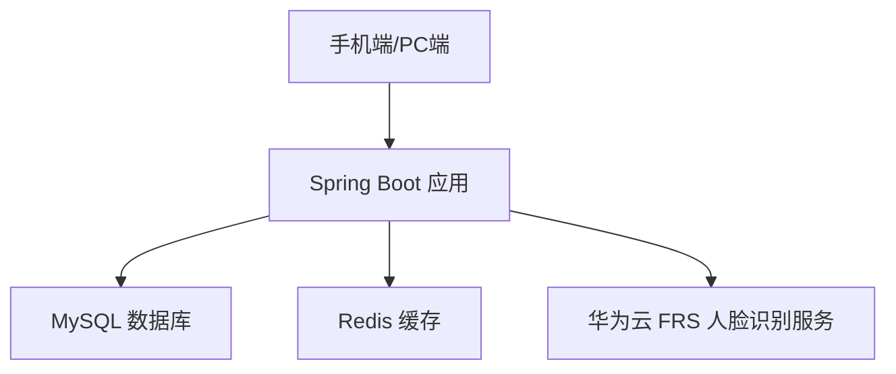

# 人脸识别签到系统 - 设计文档

## 一、项目概述

基于华为云人脸识别服务（FRS）构建的 Spring Boot 后端服务，支持用户注册时上传人脸、每日刷脸签到（无需登录）、查看签到记录等功能。支持手机端和PC端使用。

---

## 二、系统架构



### 架构说明

| 层级 | 组件 | 说明 |
|------|------|------|
| 应用层 | Spring Boot | 业务逻辑处理，内嵌Tomcat，单机部署 |
| 缓存层 | Redis | 签到防重复、Token缓存、接口限流 |
| 持久层 | MySQL | 用户信息、签到记录持久化存储 |
| AI服务层 | 华为云FRS | 人脸检测、人脸搜索、人脸库管理 |

---

## 三、技术栈与SDK

### 3.1 后端框架

| 技术 | 版本 | 用途 |
|------|------|------|
| Spring Boot | 3.2.x | 核心框架 |
| Spring MVC | - | RESTful API |
| Spring Security + JWT | - | 认证授权 |
| MyBatis-Plus | 3.5.x | ORM持久化 |
| Redis (Lettuce) | - | 缓存、分布式锁、限流 |
| MySQL | 8.0 | 关系型数据库 |

### 3.2 华为云SDK

| SDK | 版本 | 用途 |
|-----|------|------|
| huaweicloud-sdk-core | 3.1.12 | SDK核心认证 |
| huaweicloud-sdk-frs | 3.1.12 | 人脸识别服务 |

### 3.3 使用的FRS API

| API | 对应SDK方法 | 业务用途 |
|-----|------------|---------|
| 人脸检测 DetectFace | `detectFaceByBase64` / `detectFaceByFile` | 注册时校验上传图片是否包含有效人脸 |
| 添加人脸 AddFaces | `addFacesByBase64` / `addFacesByFile` | 注册时将人脸添加到人脸库 |
| 人脸搜索 SearchFace | `searchFaceByBase64` / `searchFaceByFile` | 刷脸签到时搜索匹配用户 |
| 更新人脸 UpdateFace | `updateFace` | 用户更新人脸照片 |
| 删除人脸 DeleteFace | `deleteFaceByFaceId` / `deleteFaceByExternalImageId` | 注销或更换人脸时删除旧人脸 |
| 创建人脸库 CreateFaceSet | `createFaceSet` | 初始化人脸库（已创建：face-set-demo） |

### 3.4 其他依赖

| 依赖 | 用途 |
|------|------|
| jjwt | JWT Token生成与验证 |
| Redisson | 分布式锁 |
| Hibernate Validator | 参数校验 |
| Knife4j (Swagger) | API文档 |
| Lombok | 简化代码 |

---

## 四、数据库设计

### 4.1 用户表 (t_user)

| 字段 | 类型 | 说明 |
|------|------|------|
| id | BIGINT | 主，自增 |
| username | VARCHAR(64) | 用户名，唯一 |
| password | VARCHAR(128) | 密码（BCrypt加密） |
| phone | VARCHAR(20) | 手机号 |
| face_id | VARCHAR(64) | FRS返回的人脸ID |
| external_image_id | VARCHAR(64) | 外部图片ID（与用户绑定） |
| face_image_url | VARCHAR(512) | 人脸照片存储路径 |
| status | TINYINT | 状态：0禁用 1正常 |
| created_at | DATETIME | 创建时间 |
| updated_at | DATETIME | 更新时间 |

### 4.2 签到记录表 (t_attendance)

| 字段 | 类型 | 说明 |
|------|------|------|
| id | BIGINT | 主键，自增 |
| user_id | BIGINT | 用户ID |
| sign_date | DATE | 签到日期 |
| sign_time | DATETIME | 签到时间 |
| similarity | DOUBLE | 人脸匹配相似度 |
| device_type | VARCHAR(20) | 设备类型：MOBILE/PC |
| ip_address | VARCHAR(64) | 签到IP |
| created_at | DATETIME | 创建时间 |

> 唯一索引：(user_id, sign_date) 防止同一天重复签到

---

## 五、核心API设计

### 5.1 用户模块

| 方法 | 路径 | 说明 | 是否需要登录 |
|------|------|------|-------------|
| POST | /api/auth/register | 用户注册（含人脸上传） | 否 |
| POST | /api/auth/login | 用户登录（账号密码） | 否 |
| GET | /api/user/face | 查看我的人脸信息 | 是 |
| PUT | /api/user/face | 更新人脸照片 | 是 |

### 5.2 签到模块

| 方法 | 路径 | 说明 | 是否需要登录 |
|------|------|------|-------------|
| POST | /api/attendance/sign | 刷脸签到 | 否（通过人脸识别身份） |
| GET | /api/attendance/records | 查看签到记录 | 是 |
| GET | /api/attendance/today | 查看今日签到状态 | 是 |

---

## 六、核心业务流程

### 6.1 用户注册流程

1. 用户提交注册信息 + 人脸照片（Base64）
2. 调用 FRS **人脸检测** API 验证照片中有且仅有一张有效人脸
3. 检查人脸质量分数（total_score > 0.45）
4. 调用 FRS **人脸搜索** API 检查该人脸是否已注册（防重复注册）
5. 保存用户信息到数据库
6. 调用 FRS **添加人脸** API，将人脸存入人脸库（external_image_id = userId）
7. 更新用户表中的 face_id

### 6.2 刷脸签到流程

1. 用户上传实时人脸照片（Base64）
2. 调用 FRS **人脸检测** API 验证照片有效性
3. 调用 FRS **人脸搜索** API 在人脸库中搜索匹配（threshold=0.93, top_n=1）
4. 若相似度 >= 0.93，识别为匹配用户
5. Redis 检查该用户今日是否已签到（Key: `attendance:userId:date`）
6. 若未签到，写入签到记录到数据库
7. 设置 Redis 缓存标记（TTL 至当日结束）
8. 返回签到成功结果

### 6.3 更新人脸流程

1. 用户上传新人脸照片
2. 调用 FRS **人脸检测** API 验证新照片有效性
3. 调用 FRS **删除人脸** API 删除旧人脸（通过 face_id）
4. 调用 FRS **添加人脸** API 添加新人脸
5. 更新数据库中的 face_id

---

## 七、高并发处理策略

### 7.1 接口限流

- 使用 Redis + Lua 脚本实现滑动窗口限流
- 签到接口：单IP每秒最多5次请求
- 注册接口：单IP每分钟最多3次请求

### 7.2 签到防重复

- Redis 分布式锁：`lock:attendance:{userId}:{date}`
- 数据库唯一索引兜底：(user_id, sign_date)
- 先查 Redis 缓存再查库，减少数据库压力

### 7.3 FRS调用优化

- FrsClient 单例复用，避免重复创建连接
- 异步日志记录（不阻塞主流程）
- 对 FRS 调用添加超时控制（连接超时3s，读超时10s）
- 人脸搜索结果短期缓存（同一张图片短时间内不重复调用）

### 7.4 数据库优化

- 签到记录表按月分表（可选）
- 索引优化：user_id + sign_date 联合索引
- 连接池：HikariCP（Spring Boot默认）
- 读写分离（如需更大并发）

### 7.5 应用层

- 无状态设计，支持多实例水平扩展
- JWT Token 无需 Session，天然支持分布式
- Spring 异步线程池处理非核心逻辑

---

## 八、项目结构

```
src/main/java/com/example/frs/
├── FrsApplication.java                 # Spring Boot 启动类
├── config/
│   ├── FrsClientConfig.java           # 华为云FRS客户端配置
│   ├── RedisConfig.java               # Redis配置
│   ├── SecurityConfig.java            # Spring Security配置
│   └── WebMvcConfig.java              # 跨域等Web配置
├── controller/
│   ├── AuthController.java            # 认证接口（注册/登录）
│   ├── UserController.java            # 用户接口（人脸管理）
│   └── AttendanceController.java      # 签到接口
├── service/
│   ├── AuthService.java               # 认证业务
│   ├── UserService.java               # 用户业务
│   ├── AttendanceService.java         # 签到业务
│   └── FrsService.java                # FRS SDK封装（人脸检测/搜索/添加/删除/更新）
├── entity/
│   ├── User.java                      # 用户实体
│   └── Attendance.java                # 签到记录实体
├── dto/
│   ├── RegisterRequest.java           # 注册请求DTO
│   ├── SignRequest.java               # 签到请求DTO
│   └── ApiResponse.java              # 统一响应格式
├── mapper/
│   ├── UserMapper.java                # 用户Mapper
│   └── AttendanceMapper.java          # 签到Mapper
├── security/
│   ├── JwtTokenProvider.java          # JWT工具类
│   └── JwtAuthFilter.java            # JWT认证过滤器
├── exception/
│   └── GlobalExceptionHandler.java    # 全局异常处理
└── util/
   └── RateLimiter.java               # 限流工具
```

---

## 九、配置说明

```yaml
# application.yml 关键配置
huaweicloud:
  frs:
    ak: ${HUAWEICLOUD_SDK_AK}
    sk: ${HUAWEICLOUD_SDK_SK}
    region: cn-north-4
    face-set-name: face-set-demo

spring:
  datasource:
    url: jdbc:mysql://localhost:3306/frs_attendance
    username: root
    password: ${DB_PASSWORD}
  redis:
    host: localhost
    port: 6379

jwt:
  secret: ${JWT_SECRET}
  expiration: 86400000  # 24小时
```

---

## 十、安全考虑

1. **AK/SK 通过环境变量注入**，不硬编码在代码中
2. **密码 BCrypt 加密**存储
3. **JWT Token** 有效期控制，支持刷新
4. **接口限流** 防止暴力攻击
5. **HTTPS** 传输加密
6. **脸照片不落盘**，仅传输 Base64 到 FRS 服务，系统不长期存储原始照片
7. **相似度阈值 0.93**，确保识别准确性

---

## 十一、部署方案

- **单机部署**：Spring Boot（内嵌Tomcat） + MySQL + Redis，全部部署在同一台服务器
- Spring Boot 通过配置 `server.port` 直接对外提供服务
- 跨域通过 Spring MVC 的 `@CrossOrigin` 或 WebMvcConfig 配置处理
- 可选开启 HTTPS（通过 Spring Boot 内嵌 Tomcat 配置 SSL 证书）